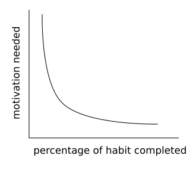

# 2 Minute Rule

* Title: 2 Minute Rule
* Creation date: 2022-12-07 
* Target audience: Nederlandstalige trainers, leraren en docenten
* License: [CC BY-SA 4.0](https://creativecommons.org/licenses/by-sa/4.0/)
* Copyright: Dion Dresschers
* Writer(s): Dion Dresschers
* Inspiration: [The 2 Minute Rule Will Quickly Change Your Life – James Clear - YouTube](https://www.youtube.com/watch?v=LFdELxwNZN0), [Atomic Habits: Tiny Changes, Remarkable Results by James Clear](https://jamesclear.com/atomic-habits)
* Original file(s): n/a
* Status: Concept
* Version date: 2022-12-07T10:18

You might procastenate or never do things that are too complex or daunting or too time consuming.

Rather than not doing it at all, focus on starting the task for 2 minutes. Don't focus on the end result but focus on the proces of doing it.

Motivation may come after starting a task, not before. 

