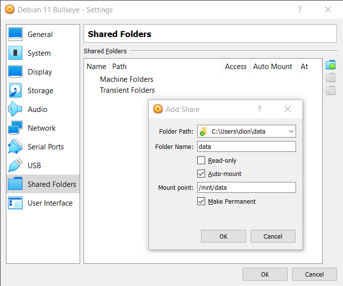

# VirtualBox Reference Sheets

* Title: VirtualBox Reference Sheets
* Creation date:  2022-02-13
* Target audience: People interested in VirtualBox
* License: [CC BY-SA 4.0](https://creativecommons.org/licenses/by-sa/4.0/)
* Copyright: Dion Dresschers
* Writer(s): Dion Dresschers
* Inspiration: not applicable
* Original file(s): 
* Status: Concept
* Version: 2022-02-13T09:03:31

Equipment: 

* Device name: e5270-win10
* Processor: Intel(R) Core(TM) i5-6300U CPU @ 2.40GHz   2.50 GHz
* Installed RAM: 8.00 GB (7.67 GB usable)
* System type: 64-bit operating system, x64-based processor
* Edition: Windows 10 Pro
* OS build: 19043.1526
* Experience: Windows Feature Experience Pack 120.2212.4170.0
* Software: VirtualBox 6.22 r144080 (Qt5.6.2)

# Enter from here the VirtualBox commands:

* Push `Windows`, type `cmd.exe`, push `Enter`
* Type `"c:\Program Files\Oracle\VirtualBox"`, push `Enter`

# VirtualBox commands:

* `vboxmanage --help` (help for 'vboxmanage')
* `vobxmanage list --help` (help for the 'vboxmanage', subcommand 'list')
* `vboxmanage list vms` (list all VMs)

# Add a printer port to a VM

* `vboxmanage modifyvm "<VM Name>" --lptmode1 "LPT1"`
* `vboxmanage modifyvm "<VM Name>" --lpt1 0x378 7`

Example:

* `vboxmanage modifyvm "Debian 11 Bullseye" --lptmode1 "LPT1"`
* `vboxmanage modifyvm "Debian 11 Bullseye" --lpt1 0x378 7`

# Add a Shared Folder to a VM with Debian 11

* Note: The username in Windows 10 host machine, as well in the Debian 11 VM is in this case `dion`
* Note: VirtualBox Guest Additions have to be installed on the VM

In VirtualBox:

* Click `Devices`-menu
* Click `Shared Folder`-item
* Click `Shared Folder settings...`-item
* Click `Adds new shared folders`-button (the folder-icon with a plus-sign)

There make these settings:

* In the VM you will see that you don't have the right to access the mounted folder:

* `dion@debian-11:~$ cd /mnt/data` results in:
* `bash: cd: /mnt/data: Permission denied`

You will see that you have access as the `root` user:

* `dion@debian-11:~$ sudo su -`
* `root@debian-11:~# cd /mnt/data`
* `root@debian-11:/mnt/data# ls -la # Shows the directory of the folder in on the Host machine`

Solution:

* The username of your current user (which is not root) should be added to the `vboxsf` Linux group.

* `sudo usermod -a -G vboxsf dion`

Now the username is added to the group:

* `dion@debian-11:~$ sudo usermod -a -G vboxsf dion`
* dion@debian-11:~$ cat /etc/group | grep vbox`, results in:
* `vboxsf:x:998:dion`

Reboot the VM with:

* `dion@debian-11:~$ sudo shutdown -r +0`

Now you have access to the directory:

* `dion@debian-11:~$ cd /mnt/data
* `dion@debian-11:/mnt/data$ ls -la # Will show the directory of the folder on your host machine.

