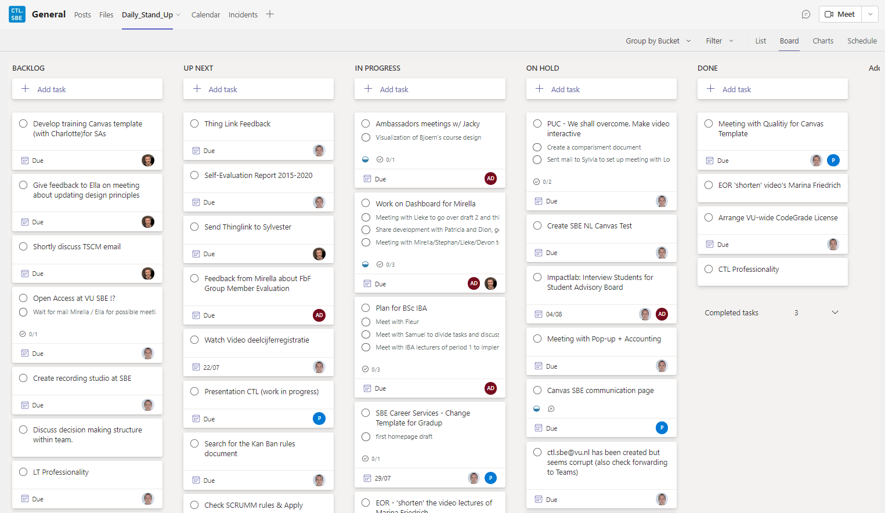

# Kan Ban Rules 🤟

Title: Kan Ban Rules
Scope: VU SBE CTL
Author: Dion Dresschers (Vrije Universiteit Amsterdam)
License: Creative Commons — Attribution-ShareAlike 4.0 International — CC BY-SA 4.0
Link: 
Version: 2022-07-22 09:13:23
State: Concept

# Notification

The formal Kan Ban [1] and Scrum [2] methodology/rules may not always be followed as other properties apply that are not usefulfor our activity.

# Kan Ban Board

Kan Ban (看板) means in Japanese sign board, which should be alwasy visible for all Members. As peoplework on different locations and integration with the VU software Microsoft Outlook, Mircrosoft Sharepoint, Microsoft Teams is good, we've created a Kan Ban board in Microsoft Teams with Microsoft Planner [3]. 

*Figure 1 - Kan Ban Board of the VU SBE CTL*

# Kan Ban Rules

1. Each workday from 08:40 until maximum 08:55 CTL members come togheter online and possible also physical for the Daily Standup.
2. Joining and act as a Speker is only mandatory if you are a Learning Technologist and if this is your working day. It's optionally for Student Assistents as timewise it may not be handy for you to join each time. It's also not mandatory for a SA to act as a Speaker.
4. If TL members can't join, than they should notify the Center for Teaching and Learning (CTL) Team beforehand via the Teams chat
5. Each Kan Ban Standup (Standup) will be maximum 15 minutes.
6. Any remaining time can be used to discuss any Tasks further, but this is not part of the Kan Ban, normandatory.
7. Each Speaker will tell:
  * What he/she/it (it) was doing.
  * What problems occured on the way (so other members could possible help).
  * What it will do today.
  * Each Speaker will have maximum 15 minutes equally devided by the amount of members online.
8. The basis is that no Speaker should be interrupted, and no whole discussion will happen during the Speakers time.
9. The LT(s) will start first and it's optionally for SA to speak as well.
10. A short interruption of getting more clarity of helping the Speaker can happen, but it the Speaker is free to ignore any comments that are not helpful.
11. Each Speaker can descide itself which updates it will give based on the number reflecting each Task
12. It can be wise to devide the amount of minutes avaible for the speaker by the amount of Tasks it wantsto talk about.
13. The general rule is to give updates that can can be useful for other team member to know.

# Creating a Task

* When creating a Task, the creator shoud use the `Assign`-icon so the Task will be assigned to the creator. The creator can also add other people that are involved in this Task.
* The Language of each Task should be English.
* The description of each Task should short. If more explaintion is needed the `Comments` field can be used.
* Additional info can be added into the `Comments`-field. This can be accessed by clicking it the Kan Ban board on the add `Comments`descide to use the action
* If there are small subtasks in a Task that than `item`s on the `Checklist` can be created.
* If there is any concrete deadline, this can be added to the calendar by clicking on `Due`.
* The use of `Add label` is not used yet, but may be added later.

# Kan Ban Lanes

The Kan Kan Board is devided into 5 lanes:

1. BACKLOG
2. UP NEXT
3. IN PROGRESS
4. ON HOLD
5. DONE

The Speaker will descide wich Tasks it creates, as long this is useful information for others and is according tot these Kan Ban Rules

## Kan Ban Lane - BACKLOG

There are Tasks that are useful to perform in the future.

## Kan Ban Lane - UP NEXT

There are Tasks on which Speaker will start soon (but not today).

## Kan Ban Lane - IN PROGRESS

There are there Tasks that the Speaker will work on today.

When beginning there may be not more than 2 Tasks per speaker, so the speaker has to focus morespecific on the Task. 
The task of each card should be able to perfom within one day.
Also at the end of the day, the initial Tasks should have been performed and resside in another Lane.

## Kan Ban Lane - ON HOLD

These are actions in which some other people have to do something, or waiting for a specific date.This is not meant for temporary storing cards for the Speaker.

## Kan Ban Lane - DONE

For earch Tasks in DONE, there should be a product produced like a PDF, presentation, spredsheet, video orelse that can useful for other people in education. So it is not the case to finish as many Tasks, but create as many as usefull materials for education and others.

# Terminology

* Lane
* Kan Ban
* CTL
* Speaker
* Task, this is each 'card' the Kan Board. 
* Standup (Kan Ban Standup)
* Backlog
* Up Next
* In Progress
* On Hold
* Done

# References

* [1] [Kanban - Wikipedia](https://en.wikipedia.org/wiki/Kanban)
* [2] [Scrum (software development) - Wikipedia](https://en.wikipedia.org/wiki/Scrum_(software_development))
* [3] [Create a plan with Planner in Teams](https://support.microsoft.com/en-us/office/create-a-plan-with-planner-in-teams-fa65ee5c-3c9b-42da-97b3-2fcd1a1c626d)
